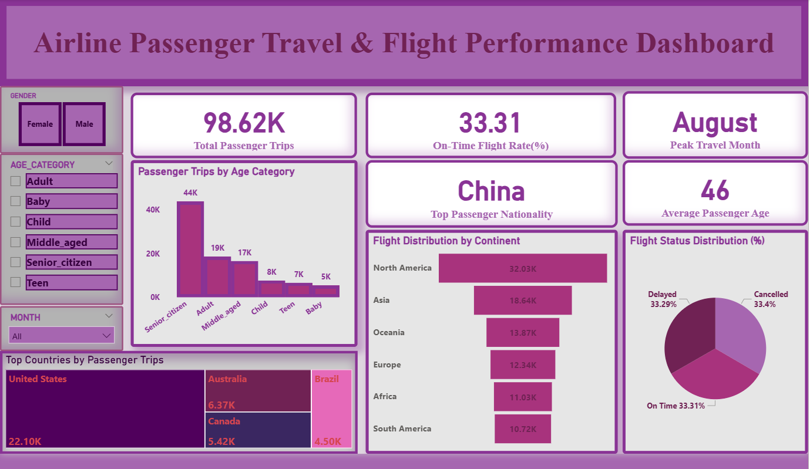

# Airline Passenger Travel & Flight Performance Analysis

## Project Overview
This project presents an end-to-end data analytics solution focused on analyzing airline passenger travel behavior and flight performance. The objective is to extract meaningful insights related to passenger demographics, travel trends, geographic patterns, and operational performance.

The project demonstrates a complete analytics workflow using Python, SQL, and Power BI.

---

## Business Objectives
The analysis answers key business questions such as:
- What is the total number of passenger trips?
- Which age group travels the most?
- Which month has the highest travel demand?
- Which country generate the most passenger traffic?
- What is the distribution of flight statuses?
- What percentage of flights were cancelled?

---

## Dataset
- **Source:** Airline Passenger Dataset  
- **Records:** ~98,000+  
- **Format:** CSV  

### Dataset Versions
- **Airline_Dataset.csv** – Original raw dataset  
- **Cleaned_Airline_Dataset.csv** – Cleaned dataset used for SQL analysis and Power BI

### Key Fields
- Passenger demographics (Age, Gender, Nationality)
- Departure & arrival airport details
- Flight status
- Country and continent
- Travel date and month

---

## 🧹 Data Cleaning & Preparation (Python)
**Tools:** Python (Pandas, NumPy)

Steps performed:
- Removed duplicate records
- Handled missing values
- Standardized categorical fields
- Created derived columns (Age Category, Departure Month, Departure Year)
- Removed redundant columns
- Validated data types

---

### Data Integration (Python → MySQL)
The cleaned data was transferred from Python to MySQL and validated to ensure accurate SQL analysis and Power BI reporting.

---

## 🧮 SQL Analysis
**Tool:** MySQL

SQL queries were used to analyze:
- Total passenger trips
- Passenger distribution by gender
- Highest traveling age group
- Most frequent departure airport
- Top country by passenger volume
- Peak travel month
- Flight status distribution
- Percentage of cancelled flights

---

## 📊 Power BI Dashboard
**Tool:** Power BI

An interactive dashboard was developed to visualize key insights and trends.

### Key KPIs
- Total Passenger Trips  
- On-Time Flight Rate (%)  
- Peak Travel Month  
- Top Passenger Nationality  
- Average Passenger Age  

### Dashboard Preview

---

## 🔍 Key Insights
- Senior citizens account for the highest number of passenger trips.
- August is the peak travel month.
- China has the highest passenger count.
- North America records the highest number of departing flights.
- Flight statuses are nearly evenly distributed across on-time, delayed, and cancelled flights.
- The average passenger age indicates a mature traveller demographic.

---

## 🛠️ Tools & Technologies
- **Python** – Data cleaning & transformation  
- **MySQL** – SQL analysis  
- **Power BI** – Data visualization

---

## Conclusion
This project demonstrates a complete data analytics pipeline, showcasing skills in data cleaning, SQL analysis, and business-focused visualization. The insights derived can support data-driven decision-making in airline operations and passenger experience optimization.

